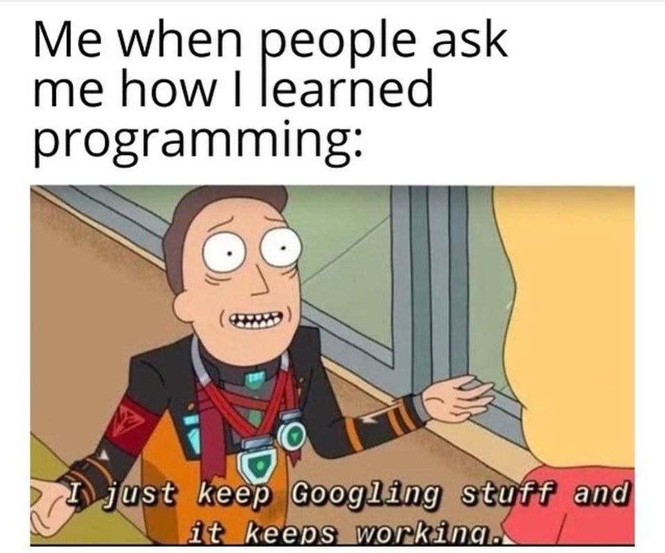

# Journal — 2025-09-20 — DAY 1

## 1) What I learned (bullets, not prose)
- Got to try the basics of SQL query like SELECT, WHERE, ORDER BY, GROUP BY, and HAVING.
- Learned about different key types: primary, foreign, composite, surrogate, and business keys.
- Understood how joins work INNER AND LEFT JOIN.
- Went through normalization (1NF, 2NF, 3NF, BCNF) and why it’s useful.
- Studied dimensional modeling (facts & dimensions) and the star schema.
- The importance of testing data / SANDBOX.

## 2) New vocabulary (define in your own words)
- **Primary Key (PK):** A unique identifier for each row in a table.
- **Foreign Key (FK):** A column that points to a primary key in another table to show relationships.
- **Star Schema:** A data model where a there is a central fact table connects to multiple tables.
- **Normalization:** The process of organizing data into separate tables to reduce redundancy and avoid data issues.
- **OLTP (Online Transaction Processing):** day-to-day transactions.
- **OLAP (Online Analytical Processing):** for reporting/analysis.
  

## 3) Data Engineering mindset applied (what principles did I use?)
- Start simple: grab the raw data, clean it up, and make the most out of it.
- Try things out and test in the sandbox before making it official.
- Make models that are both correct and easy to use.

## 4) Decisions & assumptions (why, alternatives, trade-offs)
- Decided to keep raw data separate from transformed data for clarity.
- Chose to test in the sandbox before pushing to prod. It take extra-step but it's safer.

## 5) Open questions (things I still don’t get)
- How much transformation should happen in the SQL vs. Metabase?
- How do we decide on what data we need without overloading our storage?
- When is it best to stop at 3NF instead of pushing for BCNF?

## 6) Next actions (small, doable steps)
- more practice with different JOIN types to see their effects.
- Test different grains for a fact table.
- Set up a basic dashboard in Metabase using star schema OR just doing the assignment.
  

## 7) Artifacts & links (code, queries, dashboards)
- https://dataengineering.ph/
- https://www.w3schools.com/

### Mini reflection (3–5 sentences)
This week made me realize how much structure matters in data. Normalization keeps things organized, but denormalizing later actually makes analysis smoother. The star schema made sense because it matches how business questions are asked. I’m still unsure about which modeling method fits best, but I feel like I’m getting the hang of it little by little.

### BONUS: What is a meme that best describes what you feel or your learning today?

